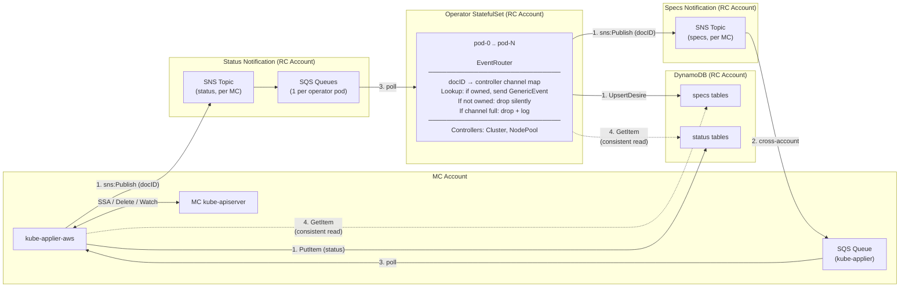

# Scalable DynamoDB Change Notification Design

## Problem

The hyperfleet-operator is limited to **2 replicas** because every replica runs its own DynamoDB Streams watcher. DynamoDB Streams allows a maximum of 2 concurrent consumers per stream shard — scaling beyond 2 risks throttling or missed events.

The alternative — polling DynamoDB directly — is inefficient. Without a native "changed since" query, each poll cycle requires reading all items a pod owns, comparing against cached state, and dispatching reconciles for changes. This produces unnecessary DynamoDB reads and reconcile loops proportional to total owned items rather than actual changes.

## Solution

Replace DynamoDB Streams with **SNS/SQS** for change notifications in both directions. The writer (operator or kube-applier) publishes the `documentID` to an SNS topic after writing to DynamoDB. SNS fans out to per-consumer SQS queues. Each consumer polls its own queue, then does a targeted `GetItem` for the actual data.

DynamoDB remains the data store. SNS/SQS replaces only the notification mechanism.

- No consumer count limits on SQS
- No DynamoDB Streams consumed at all
- Scales to any number of operator replicas or kube-applier instances

## Architecture



## Specs Path (Operator → Kube-Applier)

How kube-applier learns about new or changed desires.

### Current design

Kube-applier tails DynamoDB Streams on the specs tables using a `SharedIndexInformer` backed by a stream watcher. On startup it does a full `Scan` to populate its in-memory store, then polls the stream every 2 seconds for INSERT/MODIFY events.

### New design

1. Operator writes the desire to DynamoDB (`UpsertDesire` with `specHash` dedup — unchanged specs skip the DynamoDB write entirely).
2. Operator publishes the `documentID` to the specs SNS topic for that MC.
3. SNS delivers the message to kube-applier's SQS queue (cross-account, via SNS resource policy).
4. Kube-applier polls its SQS queue, receives the `documentID`.
5. Kube-applier does a consistent `GetItem` for the full spec and processes it.
6. Kube-applier deletes the SQS message after successful processing.

The informer's startup `Scan` remains unchanged — on boot, kube-applier still loads all specs from DynamoDB to build its in-memory store. SQS handles the incremental change notification after that.

### SNS topic

One SNS topic per MC in the RC account, covering all three specs table types (apply/delete/read). The `documentID` is unique across table types, and the SNS message payload includes the table suffix so kube-applier knows which table to `GetItem` from.

Message format:

```json
{
  "documentID": "a1b2c3d4-...",
  "tableSuffix": "specs-applydesires"
}
```

### SQS queue

Kube-applier is leader-elected (1 active replica per MC), so a single SQS queue per MC suffices. Standby replicas do not poll. The queue lives in the MC account, close to the consumer.

## Status Path (Kube-Applier → Operator)

How the operator learns about status updates from kube-applier.

### Current design

Each operator replica runs a `statusstream.Manager` that starts one `Watcher` goroutine per MC per status table suffix. Each watcher polls the DynamoDB Stream every 1 second, extracts the `documentID` from INSERT/MODIFY events, and calls `EventRouter.Dispatch(docID)`. This is the path limited to 2 consumers.

### New design

1. Kube-applier writes status to DynamoDB (`PutItem`).
2. Kube-applier publishes the `documentID` to the status SNS topic for that MC.
3. SNS delivers the message to each operator pod's SQS queue.
4. Each pod polls its own SQS queue, receives the `documentID`.
5. Pod calls `EventRouter.Dispatch(docID)`:
   - If the `documentID` is registered (this pod owns the CR): sends a `GenericEvent` to the controller's `StatusEvents` channel, triggering a reconcile.
   - If not registered (different pod's shard): drops silently.
6. Controller reconciles: calls `GetItem` with `ConsistentRead: true` to read the current status from DynamoDB.
7. Pod deletes the SQS message.

### SNS topic

One SNS topic per MC in the RC account, covering all status table types. Same message format as the specs path, with the status table suffix.

### SQS queues

One SQS queue per operator pod, all in the RC account. Each queue is independently subscribed to all MC status SNS topics. Every pod receives every status notification, but the EventRouter filters to only owned `documentIDs`. This is cheap — the messages are small strings, and `EventRouter.Lookup` is a map read.

## EventRouter

The EventRouter is unchanged. It maps `documentID → {controller channel, CR key}` and dispatches `GenericEvent`s to the right controller for the right object.

### Registration

During reconcile, after upserting desires, controllers register their document IDs:

```go
r.EventRouter.Register(docID, EventTarget{
    Channel: r.StatusEvents,    // controller-specific channel
    Key:     req.NamespacedName, // e.g., foo/bar
})
```

On CR deletion, controllers deregister:

```go
r.EventRouter.Deregister(docID)
```

### Dispatch

When a `documentID` arrives from SQS:

1. `Lookup(docID)` — finds the registered `{channel, CR key}`, or returns false if this pod doesn't own it.
2. Builds a `GenericEvent` with the CR's namespace and name.
3. Non-blocking send into the controller's `StatusEvents` channel (capacity 256).
4. If the channel is full, the event is dropped and logged. The 5-minute safety-net poll covers it.

### Routing precision

The `documentID` is deterministic (UUID v5 from `taskKey/group/version/resource/namespace/name`). The controller that created the desire registered it. A HostedCluster ApplyDesire status update triggers the ClusterController for that specific HostedCluster. A NodePool ApplyDesire status update triggers the NodePoolController for that specific NodePool.

## SQS Queue Lifecycle

### Creation

Each operator pod creates its own SQS queue on startup using a deterministic name:

```
hyperfleet-operator-{statefulset-name}-{ordinal}
```

`CreateQueue` is idempotent in SQS — if the queue already exists with the same name, it returns the existing queue URL. On restart after a crash, the pod reconnects to its existing queue and drains any backlog that accumulated during downtime.

The pod subscribes its queue to all MC status SNS topics. Subscription is also idempotent — re-subscribing to an existing subscription is a no-op.

### Scale-down

When operator replicas scale down, queues for higher ordinals go idle. Messages accumulate from SNS but nobody polls. They expire after the `MessageRetentionPeriod`.

Set `MessageRetentionPeriod` to **5 minutes** to match the safety-net poll interval. If no pod polls a message within 5 minutes, it's worthless anyway — the safety-net reconcile would have caught it.

Idle SQS queues cost nothing. SNS-to-SQS delivery is free. No cleanup is needed, though a cleanup controller watching the StatefulSet replica count could unsubscribe and delete queues for ordinals above the current count.

### Scale-up

New pods create (or reconnect to) their queues on startup and drain any backlog. No coordination needed.

## Cross-Account Access

Both SNS topics live in the RC account. Cross-account access uses IAM resource policies — the same pattern as the existing DynamoDB cross-account access.

### Specs SNS topic (RC account, published to by operator)

No cross-account needed — the operator runs in the RC account and publishes to an RC-account SNS topic.

### Status SNS topic (RC account, published to by kube-applier in MC account)

SNS topic resource policy allows `sns:Publish` from the kube-applier IAM role in the MC account:

```json
{
  "Effect": "Allow",
  "Principal": {
    "AWS": "arn:aws:iam::MC_ACCOUNT:role/kube-applier-role"
  },
  "Action": "sns:Publish",
  "Resource": "arn:aws:sns:REGION:RC_ACCOUNT:status-topic-MC_NAME"
}
```

No VPC peering or PrivateLink required. Kube-applier calls `sns:Publish` with the topic ARN over the public AWS API, authenticated via IAM (EKS Pod Identity).

### Kube-applier SQS queue (MC account, subscribed to RC-account SNS)

The SNS subscription connects an RC-account topic to an MC-account queue. This requires:

- An SNS subscription policy allowing cross-account subscribe
- An SQS queue policy allowing the SNS topic to send messages

Both are standard AWS cross-account patterns.

## Reliability

### Notification path (fast path)

SQS guarantees at-least-once delivery. Messages remain in the queue until the consumer explicitly deletes them. If a pod crashes mid-processing, the message becomes visible again after the visibility timeout (default 30 seconds).

### Safety-net polling (guarantee)

Every successful reconcile returns `RequeueAfter: 5m`. The controller re-reads status directly from DynamoDB with a consistent read. This catches:

- SNS delivery failures (extremely rare)
- EventRouter channel-full drops
- Registration races (SQS message arrives before the controller registered its `documentID`)

The safety-net poll is unchanged from the current design. The notification path (SQS instead of DynamoDB Streams) is an optimization for latency, not the consistency guarantee.

### No DLQ needed

The 5-minute safety-net poll is the catch-all. A DLQ would only capture SNS→SQS delivery failures, which are extremely rare, and the messages contain only a `documentID` string — there's nothing to recover that the safety-net poll doesn't already cover.

## Startup Behavior

On pod startup:

1. **SQS queue**: pod creates (or reconnects to) its deterministic queue. Any messages that accumulated during downtime are available to poll.
2. **EventRouter**: starts empty. No `documentID` mappings exist.
3. **Informer re-list**: controller-runtime re-lists all owned CRs from PostgreSQL, triggering a reconcile for each. Each reconcile calls `Register(docID, target)`, populating the EventRouter, and does a consistent `GetItem` to read current status from DynamoDB.
4. **SQS drain**: the pod begins polling SQS. Messages arriving before the EventRouter is populated get `Lookup` misses (dropped silently). These CRs are already being reconciled by the re-list, so nothing is lost.
5. **Steady state**: after the re-list wave completes, the EventRouter is fully populated and SQS notifications flow normally.

## Future Optimizations

### BatchGetItem

Controllers currently make individual `GetItem` calls per desire status (e.g., 8 calls for a Cluster reconcile). `BatchGetItem` reads up to 100 items per call, reducing round-trips. The `dynamoAPI` interface needs `BatchGetItem` added.

### Eventually consistent reads on the notification path

When a controller reconciles in response to an SQS notification, the status write has already happened — eventually consistent reads would return the correct data in virtually all cases. Dropping `ConsistentRead: true` on the notification-triggered path halves RCU cost. The 5-minute safety-net poll can continue using consistent reads.
